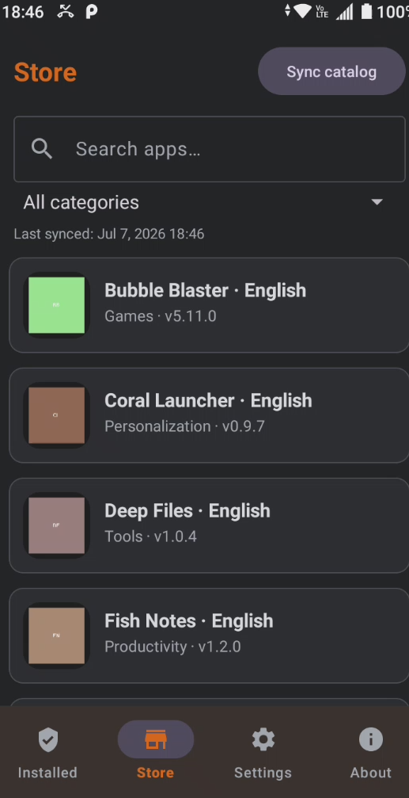

# Suitefish Android

-----------------

Suitefishfor Android is a lightweight, free and open-source app store client. It connects to a Suitefish catalog server over HTTPS, lists the apps published there, and lets you download and install them directly on your device — outside of the official app stores. By default the app talks to the official suitefish.com catalog, but you can point it at your own custom server instead, making it a simple way to distribute and self-host Android apps. The app ships with no ads and adds no tracking of its own.

[GitHub](https://github.com/bugfishtm/suitefish-android){.md-button}

